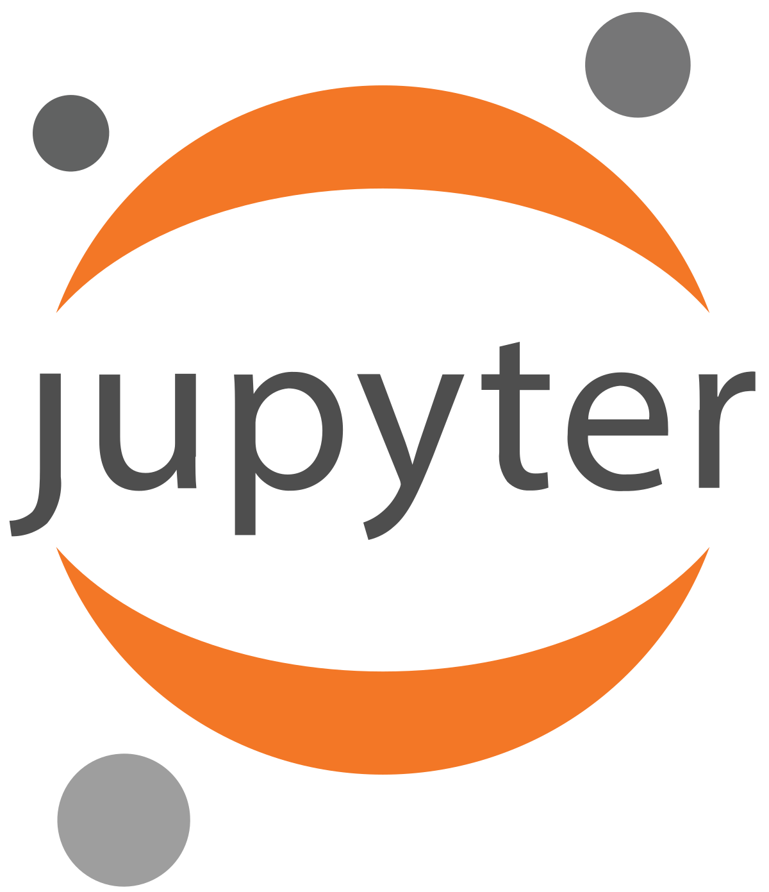
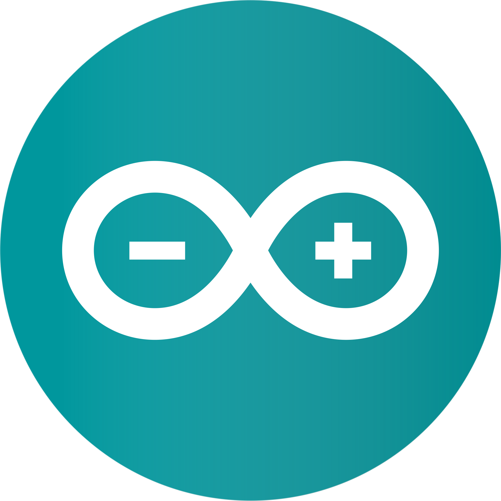
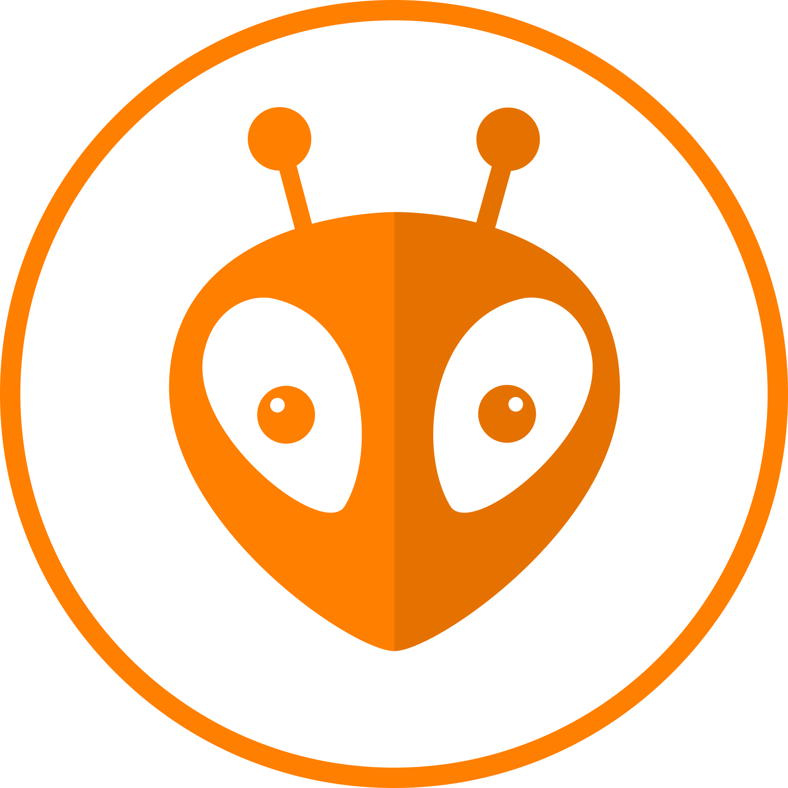
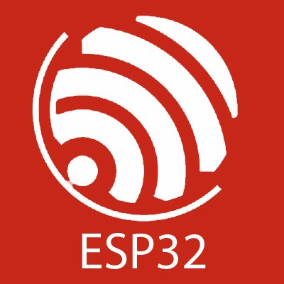

📚  Second-year student in Engineering Mechatronics  at EESC-USP São Carlos

✉️ Contact: My university email carvalho.matheush@usp.br

## Main Projects

## Frontend 
<code></code>
<code></code>
<code></code>
## Backend
<code></code>
<code></code>
<code></code>
<code></code>
## Embedded Systems
<code></code>
<code></code>
<code></code>

## Languages spoken
<code></code> Understands well, Reads well, Speaks well,  Writes well

<code></code> Understands well, Reads well,  Speaks Reasonably, Writes Reasonably

<code></code> Understands well,  Reads well, Speaks well, Writes well
